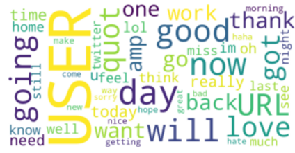
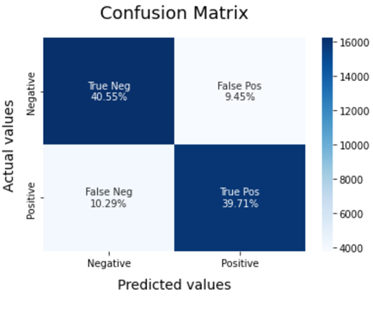
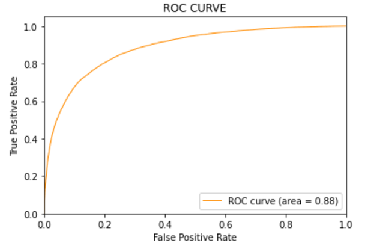
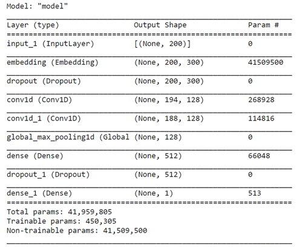
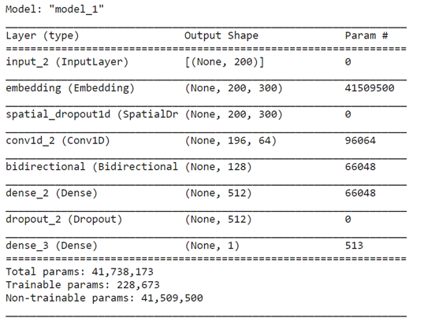
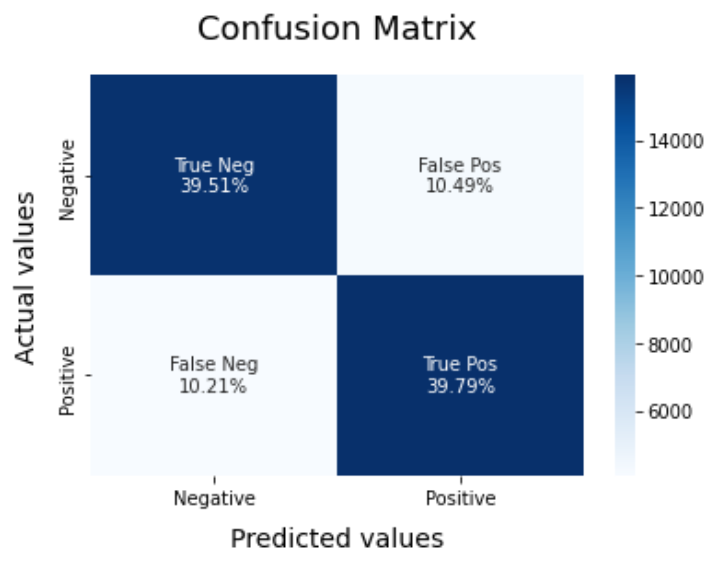
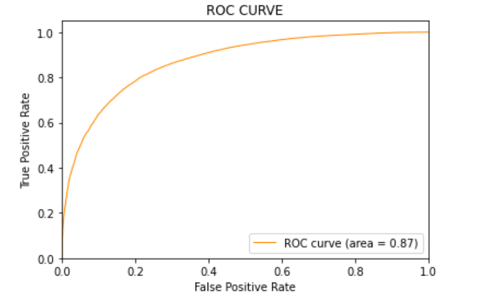
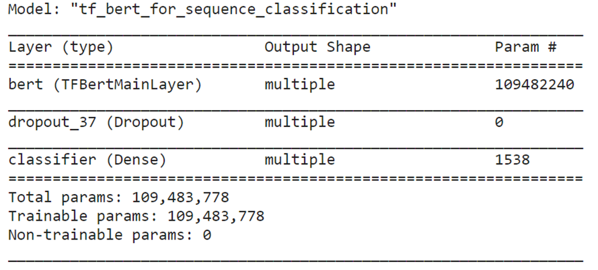

# Analyse de sentiment

# 1. Présentation générale
## 1.1. Objectifs:

La société Air Paradis souhaite détecter les éventuels Bad Buzz pour mieux les anticiper ou mieux préparer une réponse rapide.
Dans ce cadre, nous développons un outil chargé d'analyser des tweets et de prédire le sentiment positif ou négatif de ces tweets.

## 1.2. Domaine d'étude

Nous allons pour cela utiliser les réseaux de neurones profonds et plus spécifiquement dans le domaine du NLP (Natural Language Processing), c'est à dire le traitement automatique des langues.
Les données que nous allons utiliser sont des tweets en langue anglaise.

Voici des exemples du jeu de données qu'il est simple de classer :
> "Great day out"

Traduction : Super journée. Sentiment positif

> "Goodness I am tired... Ugh lack of sleep is so bad for me."

Traduction : Mon dieu, je suis épuisé... Le manque de sommeil est si mauvais pour moi. Sentiment négatif

Il y a parfois certaines phrases pour lesquelles, il est difficile de juger :

> "@TheSilentCoyote what about the podcast?"

Ainsi la tâche peut être rendue compliquée par plusieurs aspects:

- **Orthographe ou syntaxe approximative**
- **l'implicite** tel qu'avec l'humour, la dérision ou l'ironie.
- **l'analyse du contexte** 

## 1.3. Principes et évaluation

Nous allons découper notre jeu de données en deux. Nous aurons un jeu de données d'entrainement, destiné à configurer nos algorithmes pour obtenir les meilleurs performances et un jeu de données de test uniquement dédié à l'évaluation.
Un second découpage du jeu d'entrainement est aussi effectué, il est géré par la méthode fit des modèles de tensorflow.

Au sujet de la variable cible (que l'on souhaite prédire), le jeu de données est parfaitement équilibré. Ce qui signifie qu'il a autant de tweets positifs et négatifs pour le jeu d'entrainement, comme pour le jeu de test.

On souhaite explorer plusieurs approches pour avoir une bonne vision des alternatives.
On va tester plusieurs manière de préparer les données avant de les donner aux algorithmes mais aussi utiliser différents type de modèles.

Pour ce qui concerne l'évaluation nous utiliserons plusieurs métriques pour comparer nos modèles.

- **Précision**
- **Recall**
- **Specificité**
- **Accuracy**
- **F1-score**
- **La courbe ROC et le score associé AUC**
- **La matrice de confusion**
- **Temps d'entrainement**

La précision sera la métrique permettant d'ajuster les modèles. Elle peut être retenue puisque les données sont équilibrées sur la variable cible.

## 1.4. Préparation des données

On débute par une étape de Tokenisation, c'est à dire de transformation des phrases en suite de mot.
Ensuite on manipulera ses mots/tokens selon trois méthodes:
 - en les laissant brute (raw)
 - en utilisant la lemmatisation
 - en utilisant la stemmatisation

## 1.5. Modélisation

Trois principales approches seront testées :

- Une première approche avec un “Modèle sur mesure simple”  utilisera des modèles de Machine Learning classique et rapides.

- Une seconde approche avec un “Modèle sur mesure avancé” utilisera le Deep Learning, avec des plongement de mots ou Word Embedding.

- Et enfin un Modèle utilisant du transfer Learning et le modèle BERT

# 2. Analyse exploratoire

Le jeu de données est disponible sur Kaggle : [ici](https://www.kaggle.com/datasets/kazanova/sentiment140 "Jeu de donnée sentiment140 sur Kaggle").

On y retrouve  1.6 million de tweets avec 6 features/caractéristiques :
 - target: le sentiment du tweet (0 = négative, 2 = neutre**, 4 = positive)
 - ids: identifiant du tweet
 - date: la date du tweet
 - flag: la requête, s'il n'y en a pas 'NO_QUERY'.
 - user: l'auteur du tweet 
 - text: le contenu du tweet

** Même si la catégorie Neutre est recensée dans la documentation du jeu de données, on en recense aucun dans les données

Pour notre étude on retient 2 variables :
 - text
 - target

## 2.1. Variable cible

La variable cible/target est parfaitement équilibrée avec 800 000 tweets positifs et de même en tweets négatifs.

 .

## 2.2. Nuage de points

Sur l'ensemble des tweets on obtient le nuage suivant :

 .

Pour les tweets négatifs on obtient le nuage suivant :

 .

Pour les tweets positifs on obtient le nuage suivant :

 .

# 3. Preproccessing

## 3.1. Substitutions

On effectue dans un premier temps un certain nombre de subsitutions :

1. **Remplacement des URLs:** les liens débutant par **'http' or 'https' or 'www'** sont remplacés par **'<url\>'**.
2. **Remplacement des utilisateurs:** on remplace les @Usernamespar le mot **'<user\>'**. ['@Kaggle' to '<user\>'].
3. **Remplacement des lettres consécutives:** 3 or more consecutive letters are replaced by 2 letters. ['Heyyyy' to 'Heyy']
4. **Remplacement des Emojis:** on remplace les emojis par leur sens. [':)' to '<smile\>']
5. **Remplacement des Contractions:**: on remplace les contractions par leur forme développée. ["can't" to 'can not']
6. **Remplacement des caractères spéciaux:** on remplace les caractères qui ne sont pas des chiffres, lettres, caractères prédéfinis par un espace.

## 3.2. Tokenisation

Les tweets sont découpés en mots/token avec la fonction word_tokenize de nltk.
Les mots/token ainsi formé peuvent ensuite passer à la lemmatisation/stemmatisation

## 3.3. Lemmatisation/Stemmatisation

La lemmatisation consiste à enlever ses accords, déclinaisons pour le rendre à sa forme la plus simple.
Par exemple en le réduisant à l'infinitif pour un verbe ou au masculin-singulier pour un nom.

La stemmatisation/racinisation consiste à réduire chaque mot à sa racine. Par exemple en enlevant des préfixes, suffixes.

# 4. Modélisation

On utilise pour chaque modélisation un échantillon de 200 000 tweets (équilibré).

## 4.1 Modèle simple

Pour les modèles simples, les modèles évalués sont les suivants :
 - Régression logistique
 - Naive Bayes
 - Support Vector Classifier

On utilise la méthode TF-IDF pour traiter les tweets et former une matrice creuse représentant les mots/tokens.
On limite le nombre de features à 500 000.

### 4.1.1. Résulats

Les temps d'entrainement sont assez courts pour ces modèles, de part leur simplicité.
Pour ce qui est de l'accuracy, on obtient les résulats suivant :

| Preprocess         | Aucun   | Lemmatization | Stemming  |
|--------------------|---------|---------------|-----------|
| LogisticRegression | 80,28%  | 77,88%        | 77,70%    |
| SVC                | 79,69%  | 76,86%        | 76,81%    |
| Naive Bayes        | 78,58%  | 76,75%        | 76,64%    |

Pour ce qui est de l'aire sous la courbe ROC (AUC), on obtient les résulats suivant :

| Preprocess         | Aucun  | Lemmatization | Stemming |
|--------------------|--------|---------------|----------|
| LogisticRegression | 88,38% | 85,93%        | 85,82%   |
| SVC                | 87,80% | 85,06%        | 84,86%   |
| Naive Bayes        | 85,94% | 84,29%        | 84,10%   |

**Bilan**

Pour le preprocessing, son absence donne nettement de meilleur résultats.  
La régression logistique obtient des résultats légèrement au-dessus du Support Vector Classifier. 

### 4.1.2. Modèle retenue

Le modèle retenu est donc la régression Logistique avec les paramètres suivantes : C = 2 et 1000 itérations

Les performances sont donc
* Accuracy : 80,28%
* ROC AUC : 88,38%
* Temps d’entrainement : 30 secondes

 

## 4.2. Modèle avancé

### 4.2.1. Alternatives

Plusieurs plongement de mots/embedding sont possibles, nous évaluerons les embeddings suivants :
* Fasttext
* Glove
* Word2Vec

Pour chaque embedding, on pourra tester deux méthodes, avec ou sans LSTM avec les structures suivantes :

### 4.2.2. Performances des modèles

Les résultats avec les données brutes sont les suivants :

| Embedding | Glove  | Word2Vec | FastText |
|-----------|--------|----------|----------|
| Sans LSTM | 78.16% | 75.51%   | 77.56%   |
| Avec LSTM | 79.30% | 76.63%   | 78.98%   |

Les résultats avec lemmatisation sont les suivants :

| Embedding | Glove  | Word2Vec | FastText |
|-----------|--------|----------|----------|
| Sans LSTM | 75.91% | 71.86%   | 75.12%   |
| Avec LSTM | 76.36% | 73.62%   | 75.72%   |

Les résultats avec stemmatisation sont les suivants :

| Embedding | Glove  | Word2Vec | FastText |
|-----------|--------|----------|----------|
| Sans LSTM | 73.92% | 72.71%   | 73.19%   |
| Avec LSTM | 74.16% | 73.78%   | 74.08%   |

**Bilan**

On s'aperçoit encore une fois que sans préprocessing, les résultats sont meilleurs.
Pour le LSTM, les résultats sont globalement meilleurs et la vitesse de convergence est elle aussi plus importante. C'est à dire qu'il y a besoin de moins d'epochs pour atteindre la meilleur performance.
Les temps d'entrainement sont par contre multiplié par 5 ou 6.

### 4.2.3. Modèle retenu

On part du principe que le temps d'entrainement n'est pas un problème  et on retient donc le modèle avec :
* un plongement de mots Glove
* Avec LSTM

## 4.3. Modèle BERT

### 4.3.1. Présentation

Le modèle BERT pour Bidirectional Encoder Representations from Transformers est un modèle de représentation de textes écrit.
Par rapport aux plongement de mot classqiue, il a la particularité d’être contextuel. 

On utilise une version pré-entraînée de BERT qui est adéquate pour l'analyse de sentiment : bert-base-uncased.
On effectue un fine-tuning de ce modèle.

### 4.3.2. Résultats

On obtient de forte performances avec
* Accuracy : 84,25%
* ROC AUC : 90,21%
